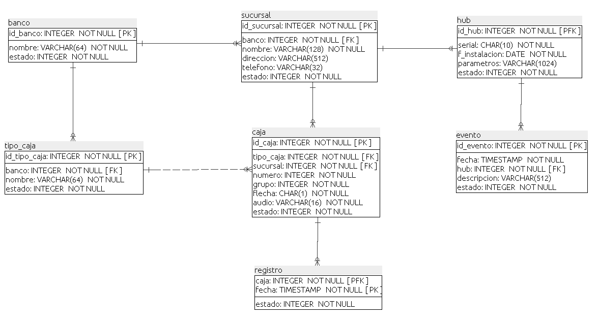
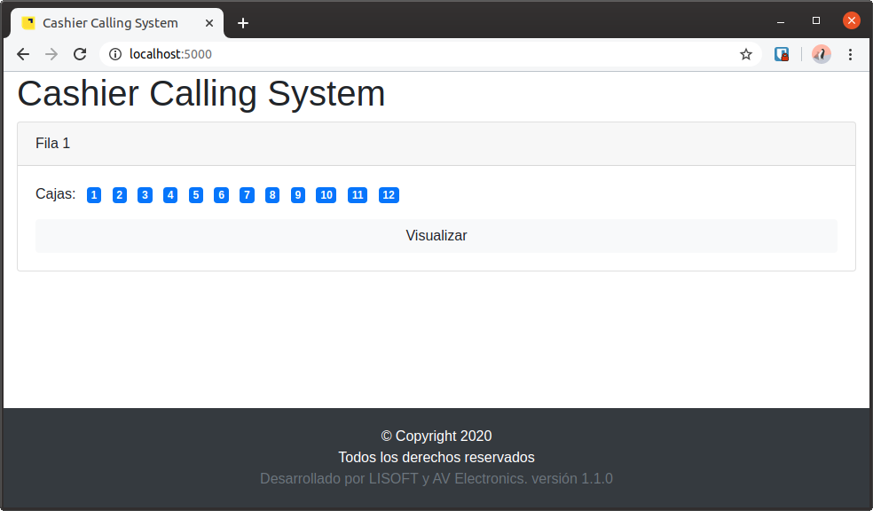

# Cashier Calling System
Sistema de Llamado a Cajas. Aplicación de servidor para registrar la caja que se libera y visualiza a través de un 
navegador web. 

## Empezando 
Estas instrucciones te permitirán obtener una copia del proyecto en funcionamiento en tu máquina local para propósitos 
de desarrollo y pruebas.

### Pre-requisitos
Necesitas **Python 3.7 o superior**, el entorno virtual y la base de datos MariaDB.  
```shell script
$ sudo apt install python3 python3-venv mariadb-server
```
Configura correctamente la base de datos.
```shell script
$ sudo mysql_secure_installation
```
Crear un esquema para el proyecto.
```shell script
MariaDB[(none)]> create schema db_ccs;
```
### Instalación
Clonar el proyecto del repositorio.
```shell script
$ git clone https://github.com/rtufino/ccs-server.git
```
Crear el entorno virtual e instalar las librerías.
```shell script
$ cd ccs-server
$ python3 -m venv venv
$ source venv/bin/activate
(venv) $ pip install -r requirements.txt
```
Crear el archivo de configuración de la aplicación.
```shell script
(venv) $ vi .env
```
Copiar el siguiente contenido:
```text
SECRET_KEY=secret!
CODE_KEY="48b9f2fdb33fd40db329a60aad6c9148775a2b6a723ef45215d85e438f35392e"
DEBUG=True
DATABASE="mysql+pymysql://[user]:[password]@[server]/db_ccs"
DOMAIN=0.0.0.0:5000
```
* SECRET_KEY - Clave para WebSockets
* CODE_KEY - Clave para comunicación con el HUB.
* [user] - Usuario de la base de datos.
* [password] - Contraseña de la base de datos.
* [server] - Dirección IP o dominio del servidor.

Crear las tablas del proyecto.
```shell script
(venv) $ python modelos.py db init
(venv) $ python modelos.py db migrate
(venv) $ python modelos.py db upgrade
```
El diagrama de la base de datos es el siguiente:


Ejecutar la aplicación.
```shell script
(venv) $ python app.py
```

## Referencias
* [WebSockets y SQLAlchemy](https://programadorwebvalencia.com/tutorial-flask-para-crear-chat-con-socketio-y-vuejs/) -
Tutorial de Flask + WebSockets + SQLAlchemy.